# Postgres на виртуальной машине в Google Cloud

Цель проекта на примере PostgreSQL научиться развертывать СУБД в облаке гугл, используя **IaaS сервис Compute Engine**.
Потренироваться с работой в командной строке.

Заодно проверить на практике, как в postgres происходит работа с изоляциями на разных уровнях.
Уровень изоляции транзакции определяет, какие данные может видеть транзакция, когда параллельно с ней выполняются другие транзакции:

**READ COMMITTED**

Оператор видит только те строки, которые были зафиксированы до начала его выполнения. Этот уровень устанавливается по умолчанию.

**REPEATABLE READ**

Все операторы текущей транзакции видят только те строки, которые были зафиксированы перед первым запросом на выборку или изменение данных, выполненным в этой транзакции.

**SERIALIZABLE**

Все операторы текущей транзакции видят только те строки, которые были зафиксированы перед первым запросом на выборку или изменение данных, выполненным в этой транзакции. Если наложение операций чтения и записи параллельных сериализуемых транзакций может привести к ситуации, невозможной при последовательном их выполнении (когда одна транзакция выполняется за другой), произойдёт откат одной из транзакций с ошибкой serialization_failure (сбой сериализации).

В стандарте SQL определён ещё один уровень, READ UNCOMMITTED. В Postgres уровень READ UNCOMMITTED обрабатывается как READ COMMITTED.

## Этапы

1. Регистрируемся в Google Cloud и создаем новый проект
2. Создаем виртуальную машину
3. Подключаемся к консоли сервера с рабочего компьютера через ssh
4. Устанавливаем postgresql и postgresql-contrib
5. Тестируем поведение системы при разных уровнях изоляции READ COMMITTED (по умолчанию) и REPEATABLE READ

### 1. Регистрируемся в Google Cloud и создаем новый проект
Создаем новый проект Test

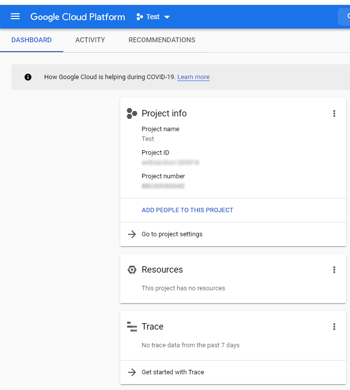

Добавляем права на свой рабочий email

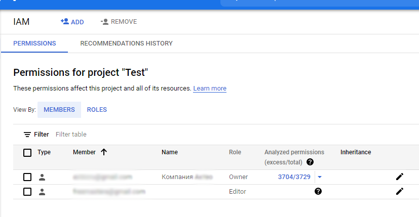


### 2. Создаем виртуальную машину

Cоздаем виртуальную машину, куда будем ставить postgres

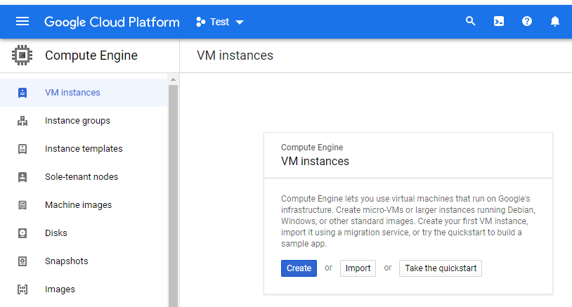

Операционной системой выбираем ubuntu

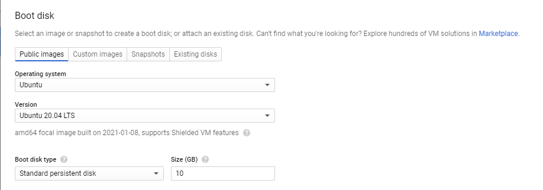


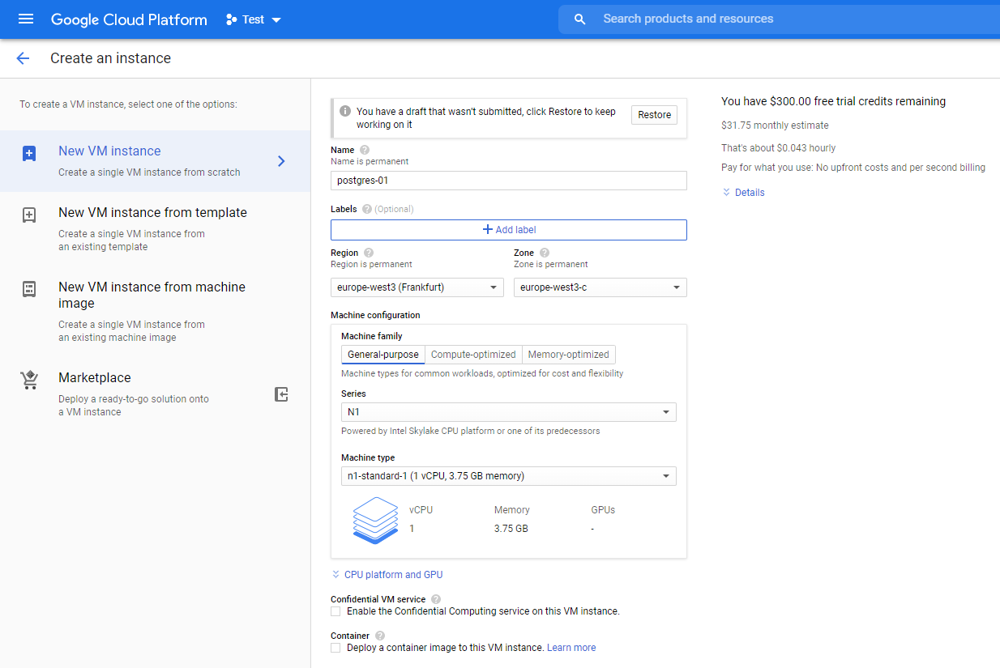


Создалась  виртуалка и ей выделился внешний ip адрес. На подарочный сертификат с триалом дается только один ip адрес.

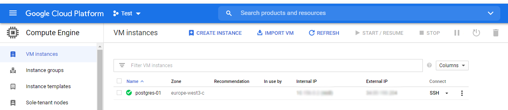


Прямо отюда можно зайти через ssh

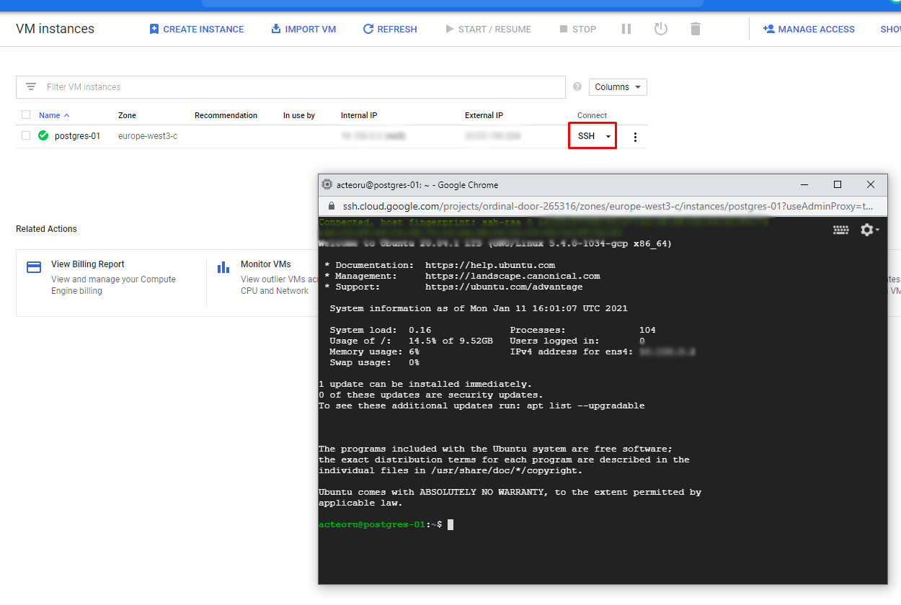

### 3. Подключаемся к консоли сервера с рабочего компьютера через ssh

Чтобы зайти своим клиентом нужно подгрузить ssh ключ

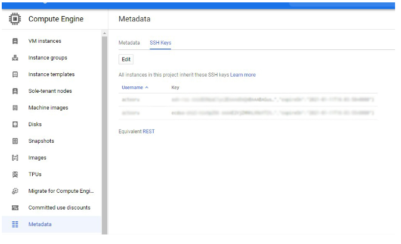

Загрузим новый ключ

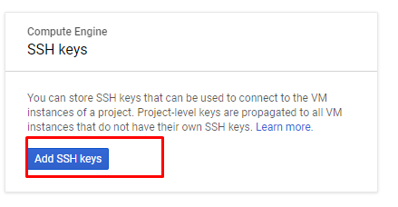

Копируем наш публичный ключ с рабочей машины в гугл клауд. Если еще нет, то генерируем ключ командой ssh-keygen имя

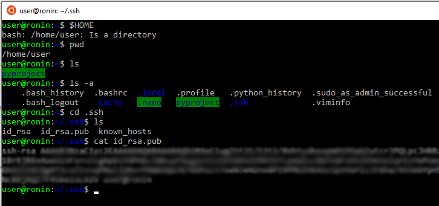

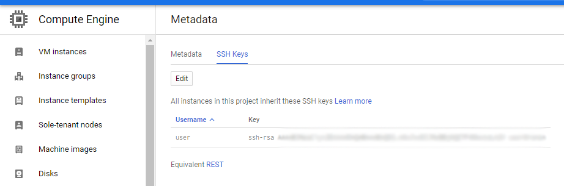

Теперь попробуем подключиться 

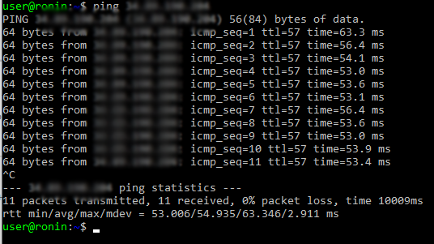

Заходим на виртуалку через команду ssh имя@ip созданной ВМ

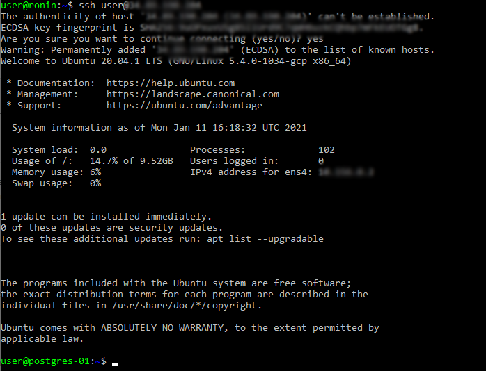


Обновим списки пакетов через команду sudo apt update

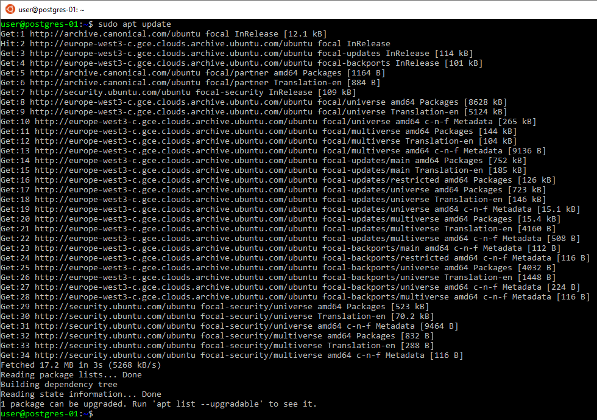


### 4. Устанавливаем postgresql и postgresql-contrib
Устанавливаем postgres с библиотеками
с помощью команды sudo apt install postgresql  postgresql-contrib


Создадим новый пароль для sudo через команду sudo passwd


Войдем под суперпользователем

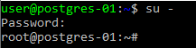


Войдем под пользователем postgres, под которым по умолчанию ставится PostgreSQL
su - postgres

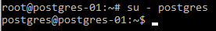

На всякий случай проверим запустился ли он. По умолчанию postgres создает дефолтный кластер (инстанс базы данных). Также создается дефолтная база

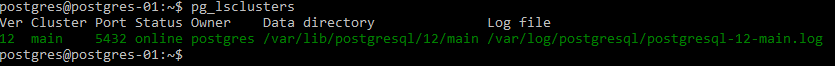

Запускаем командный интерпретатор postgres. Команда psql

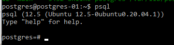

\dt  показать таблицы

\du показать пользолвателей

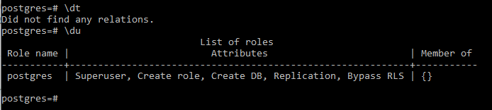

### 5. Тестируем поведение системы при разных уровнях изоляции


Введем команду show transaction_isolation;

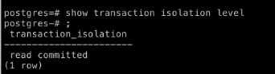


Пока ничего не меняем, делаем табличку test с демо данными

```sql 
create table persons(id serial, first_name text, second_name text);
insert into persons(first_name, second_name) values('ivan', 'ivanov');
insert into persons(first_name, second_name) values('petr', 'petrov');
commit;
```

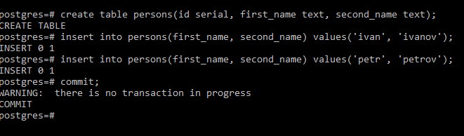

Проверяем данные 

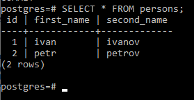

Открываем вторую сессию в командной строке и заходим через postgres. Проверяем данные в таблице, все также

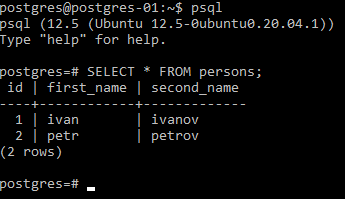

Теперь в первой сессии добавим новую строку

```sql
insert into persons(first_name, second_name) values('sergey', 'sergeev');
```

И посмотрим что изменилось во второй сессии

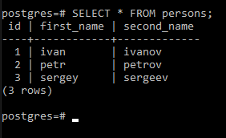

Видим, что добавилась новая строка

А теперь попробуем при выключенном автокоммите

\set AUTOCOMMIT off <br>
\echo :AUTOCOMMIT

По умолчанию autocommit включен. 

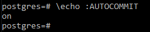

Что значит, что при выполнении каждой команды неявно срабатывает оператор commit. Отключим его временно. Его нужно будет выполнять вручную. Commit это когда мы завершаем транзакцию

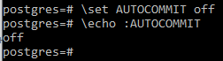

Теперь вставляем новую строку

```sql
insert into persons(first_name, second_name) values('Анастасия', 'Романова');
```

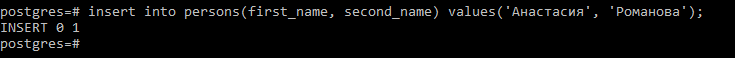

И смотрим в окне второй сессии, что изменилось

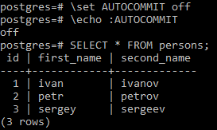

Видим, что таблица не изменилась

Теперь закомиттим данные в первой сессии COMMIT;

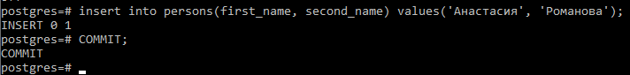

Проверяем данные во втором окне

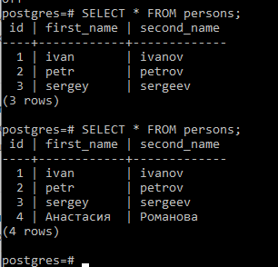

Видим, что данные этой транзакции появились.
Это уровень изоляции read_commited. Это уровень по умолчанию и впринципе большинство программ разрабатывается так, чтобы с этим уровнем работать. Его особенность в том, что каждая следующая команда будет видеть уже новые данные.

Например, если у нас есть отчет, который предполагает неизменность данных за все время своего выполнения и состоит он из нескольких селектов. То такой уровень, как read\_commited этому отчету не подойдет. Если мы запускаем какой-то логический бекап нам тоже этот уровень не подойдет. Явно будет несколько селектов, котоыре должны исходить из того, что транзакция будет большая от начала и до конца. Поэтому есть следующий уровень repetable_read и мы сейчас попробуем в него переключиться

Начинаем новые, но уже repeatable read транзации  

Введем команду в обеих сессиях

```
BEGIN TRANSACTION ISOLATION LEVEL REPEATABLE READ;
```

Добавим новые записи в первой сессии

```sql
insert into persons(first_name, second_name) values('Johny', 'Silverhand');
```

В первой сессии мы видим новые данные

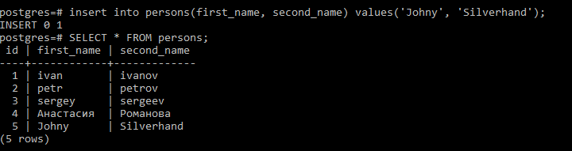

А вот во второй нет, несмотря на то что автокоммит включен

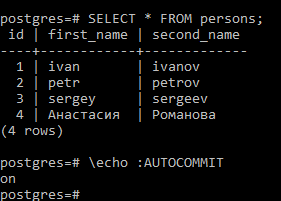
