# Перенос данных из Excel в postgres. Аналитические SQL запросы к базе

## Исходные данные

Файл с продажами мебельного магазина [в формате xls](sources/Sample%20-%20Superstore.xls)

**Значения атрибутов в Sample - Superstore.xls**

Название столбца | Значение
----------------|----------------------
Row ID       | Идентификатор строки (уникальный)
Order ID   | Идентификатор заказа
Order Date   | Дата заказа
Ship Date      | Дата доставки
Ship Mode    | Класс доставки
Customer ID | Идентификатор покупателя
Customer Name     | Имя и фамилия покупателя
Segment   | Сегмент покупателя
Country     | Страна
City       | Город
State      | Штат
Postal Code   | Почтовый индекс
Region      | Регион
Product ID    | Идентификатор товара
Category | Категория
Sub-Category     | Подкатегория
Product Name   | Название товара
Sales     | Продажи (Доход)
Quantity       | Количество
Discount    | Скидка в %
Profit   | Прибыль
Person     | Региональный менеджер
Returned   | Возвраты товара 


## Dimensional modeling. Star schema
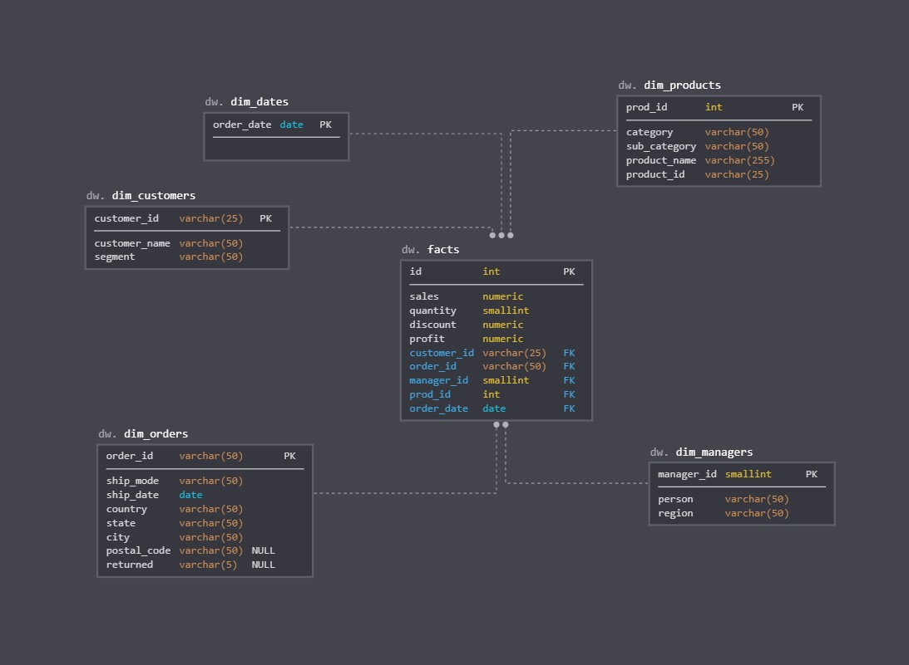

product_id, к сожалению, [не уникальный](img/nonunique_productid.jpg). 
Поэтому сгенерировал отдельный айдишник. Для менеджеров тоже взял суррогатный, фамилия может меняться.

## Запросы для создания таблиц

<ol>
<li>Оригинальные, как в excel документе:<br><br>
stg\_orders.sql<br>
stg\_people.sql<br>
stg\_returns.sql<br>
 </li>

<li>Нормализованные по схеме "Звезда":<br><br>
dw\_create\_tables.sql - создание таблиц<br>
dw\_insert\_dimensions.sql - вставка данных в таблицы измерений<br>
dw\_insert\_facts.sql - вставка данных в таблицу фактов<br><br>
    
  </li>

## SELECT запросы для проверки

Выбираем метрики из stg.orders, а измерения из dw.dim_*<br>


```sql
select
o.sales,
o.quantity,
o.discount,
o.profit,
c.customer_id, 
c.customer_name,
c.segment,
d.order_date,
m.manager_id, 
m.person,
m.region,
p.prod_id,
p.product_id,
p.product_name,
p.category,
p.sub_category,
ord.order_id,
ord.ship_mode,
ord.ship_date,
ord.country,
ord.state,
ord.city,
ord.postal_code,
ord.returned 
from stg.orders o inner join dw.dim_customers c on o.customer_id = c.customer_id
join dw.dim_dates d on o.order_date = d.order_date
join dw.dim_managers m on o.region = m.region
join dw.dim_products p on o.product_id = p.product_id and p.product_name= o.product_name 
join dw.dim_orders ord on o.order_id = ord.order_id
```


 
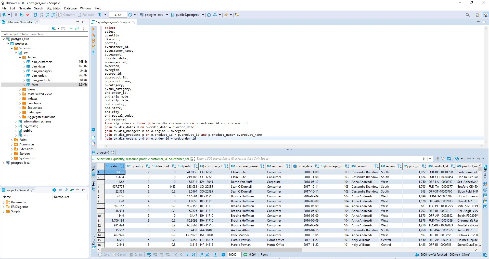
 <br><br>
 
Выводим все записи из нормализованных таблиц
<br>

```sql
select * from dw.facts f 
join dw.dim_customers c on c.customer_id =f.customer_id 
join dw.dim_products p on p.prod_id =f.prod_id
join dw.dim_orders o on o.order_id =f.order_id 
join dw.dim_dates d on d.order_date =f.order_date 
join dw.dim_managers m on m.manager_id =f.manager_id 
```

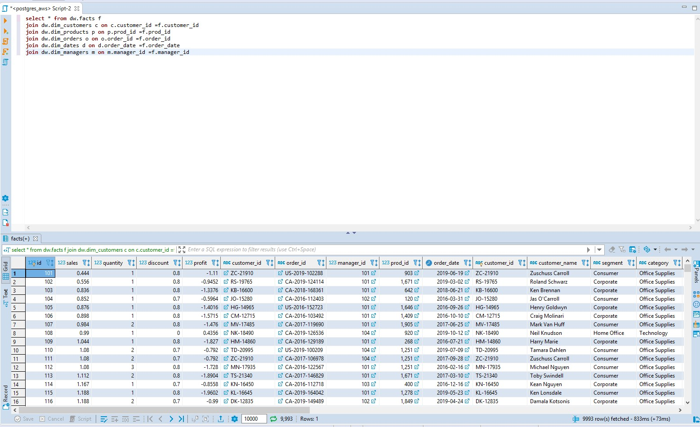
<br><br>
Получаем 9993, хотя в примере выше 9994. И в экселе тоже 9994(без строки с заголовками). Почему так? Дело в том что, в исходном файле, есть один дубль строки.
Если мы выполним предыдущий запрос, добавив DISTINCT, то тоже получим 9993.
В экселе, если удалить столбец с суррогатным id (первый столбец Row ID), а затем удалить дубликаты, то также будет 9993 строк.


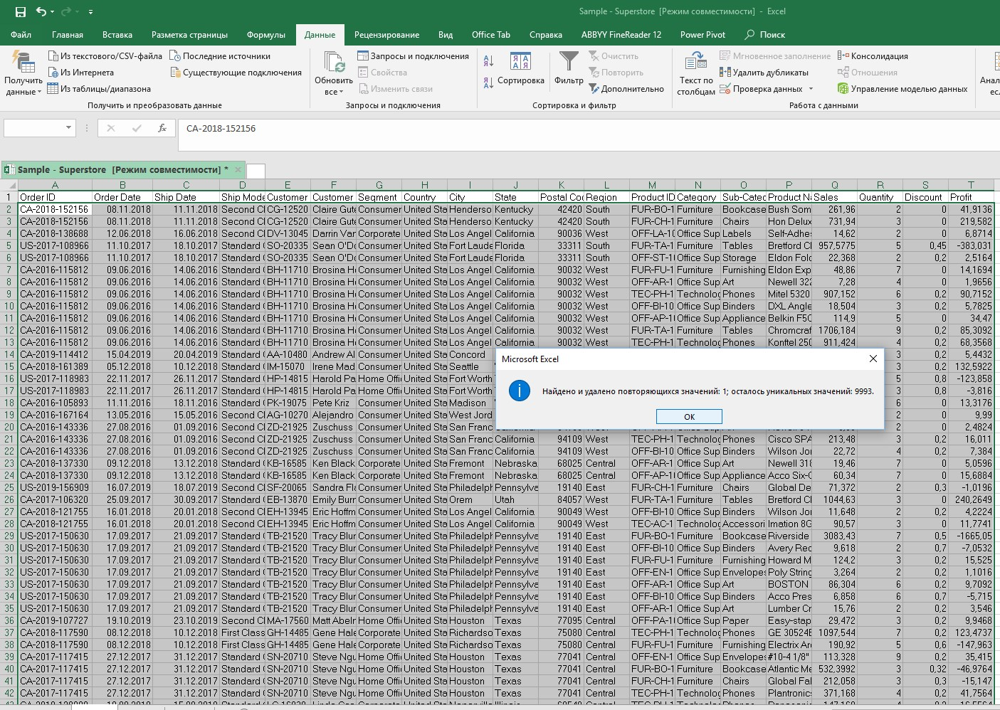

## Зарегестрировался в Amazon Web Services(AWS) и добавил данные в облако<br>
 
  Заодно добавил схемы stg(сырые данные) и dw(по схеме звезда)
 
 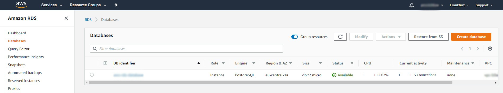
 <br><br>
## Аналитические запросы к базе 


### Overview (обзор ключевых метрик)

#### Total Sales <br>
```sql
select round(sum(sales),0) from dw.facts f
```

  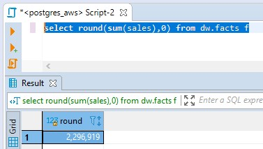
 <br><br>
#### Total Profit <br>
```sql
select round(sum(profit),0) from dw.facts
```

  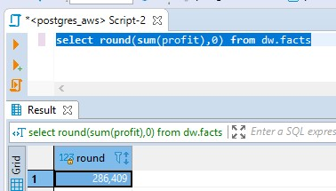
  
 <br><br>
#### Profit Ratio <br>
```sql
select ROUND(sum(profit)/sum(sales),2) from dw.facts
```

  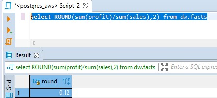
 <br><br>
  
#### Profit per Order <br>
```sql
select ROUND(sum(f.profit) / count(distinct f.order_id),0) from dw.facts f
join dw.dim_orders o on o.order_id =f.order_id  
```

  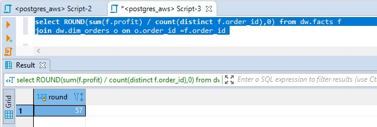
 <br><br>

#### Sales per Customer <br>
```sql
select ROUND(sum(f.sales) / count(DISTINCT c.customer_id),0) from dw.facts f
join dw.dim_customers c on c.customer_id =f.customer_id
``` 

  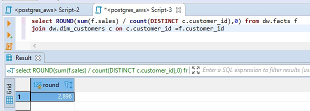
 <br><br>
#### Avg. Discount <br>
```sql
select ROUND(avg(discount),2) from dw.facts
```


  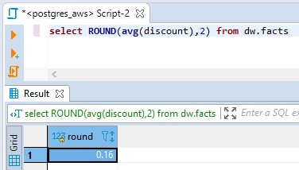
 <br><br>
 
#### Monthly Sales by Segment  <br>
```sql
select EXTRACT(year FROM d.order_date) as year,EXTRACT(month FROM d.order_date) as month,sum(f.sales),c.segment from dw.facts f
join dw.dim_dates d on d.order_date =f.order_date
join dw.dim_customers c on c.customer_id =f.customer_id
group by c.segment,year,month
order by year DESC,month DESC,segment
```

  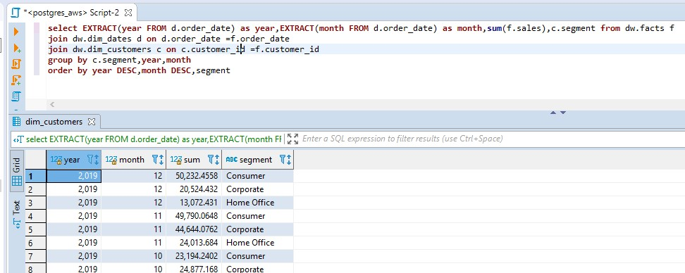
 <br><br>

#### Montly Sales by Product Category  <br>
```sql
select EXTRACT(year FROM d.order_date) as year,EXTRACT(month FROM d.order_date) as month,sum(f.sales),p.category from dw.facts f
join dw.dim_dates d on d.order_date =f.order_date
join dw.dim_products p on p.prod_id =f.prod_id
group by p.category,year,month
order by year DESC,month DESC,p.category
```

  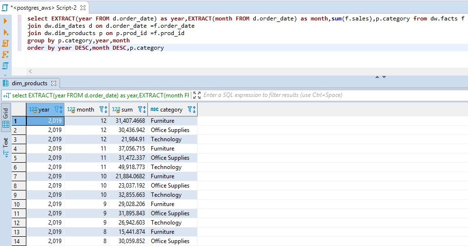
 <br><br>
   
### Product Dashboard (Продуктовые метрики)
#### Sales by Product Category over time (Продажи по категориям) <br>
```sql
select d.order_date as month,sum(f.sales),p.category from dw.facts f
join dw.dim_dates d on d.order_date =f.order_date
join dw.dim_products p on p.prod_id =f.prod_id
group by p.category,d.order_date
order by d.order_date DESC,p.category
```

  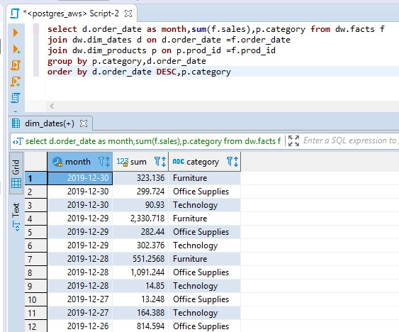
 <br><br>

### Customer Analysis
#### Sales and Profit by Customer <br>
```sql
select sum(f.sales) as sales,sum(f.profit) as profit,c.segment from dw.facts f
join dw.dim_customers c on c.customer_id =f.customer_id
group by c.segment
order by segment
```

  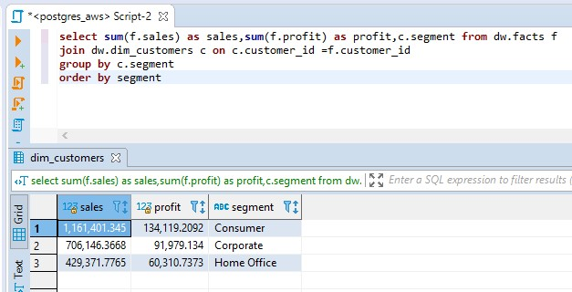
 <br><br>
 

#### Sales per region <br>
```sql
select m.region, ROUND(sum(f.sales)) as sales from dw.facts f
join dw.dim_managers m on m.manager_id =f.manager_id
group by region
order by sales DESC
```

  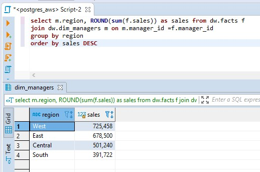
 <br>

 
## Подключился к базе данных в облаке из Data Sudio и создал визуализацию<br>
  
 С датой в поле order_date возникли проблемы. Data studio путал месяц и день, поэтому в запросе создал новое поле FormattedDate с преобразованным форматом даты.
 
```sql
select *,to_char(f.order_date, 'YYYY-MM-DD') AS FormattedDate from dw.facts f 
join dw.dim_dates d on d.order_date =f.order_date 
join dw.dim_customers c on c.customer_id =f.customer_id 
join dw.dim_products p on p.prod_id =f.prod_id
join dw.dim_orders o on o.order_id =f.order_id 
join dw.dim_managers m on m.manager_id =f.manager_id
```


<br><br>
Ссылка на отчет в Data Studio
<br>
[https://datastudio.google.com/reporting/f31df262-28da-46e6-bf50-068a8fd3589c](https://datastudio.google.com/reporting/f31df262-28da-46e6-bf50-068a8fd3589c)

