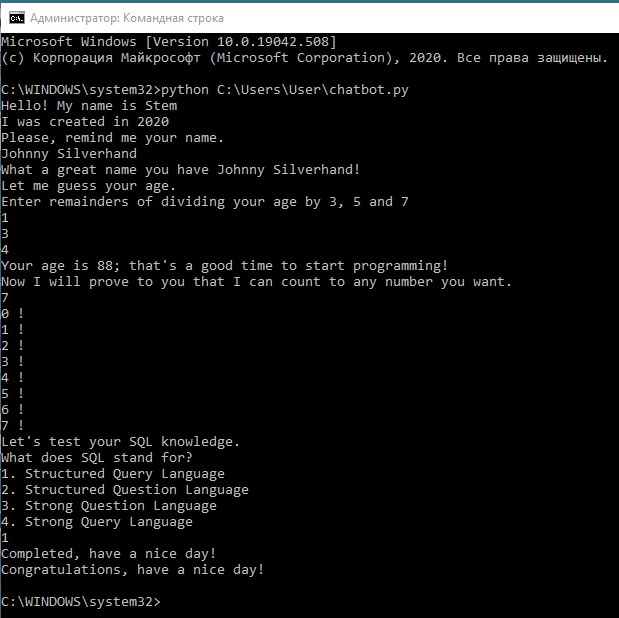

# Простой чат-бот на Python

В этом небольшом проекте я решил написать простого бота, который умеет делать следующие вещи:

* Может поприветствовать пользователя, сказав свое имя и дату создания.
* Спросить имя у пользователя
* Угадать возраст пользователя, используя математический трюк<br>
Где remainder3, remainder5 и remainder7 - это остатки от деления возраста на 3, 5 и 7, соответственно.<br>
```age = (remainder3 * 70 + remainder5 * 21 + remainder7 * 15) % 105
```

*  Уметь считать от 0 до любого положительного числа введеного пользователем
*  Задать тестовый вопрос пользователю и проверить ответы

## Как запустить

Через терминал/командную строку

```python chatbot.py
```

Пример

